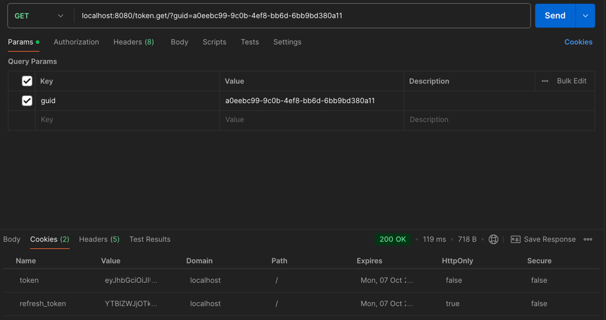
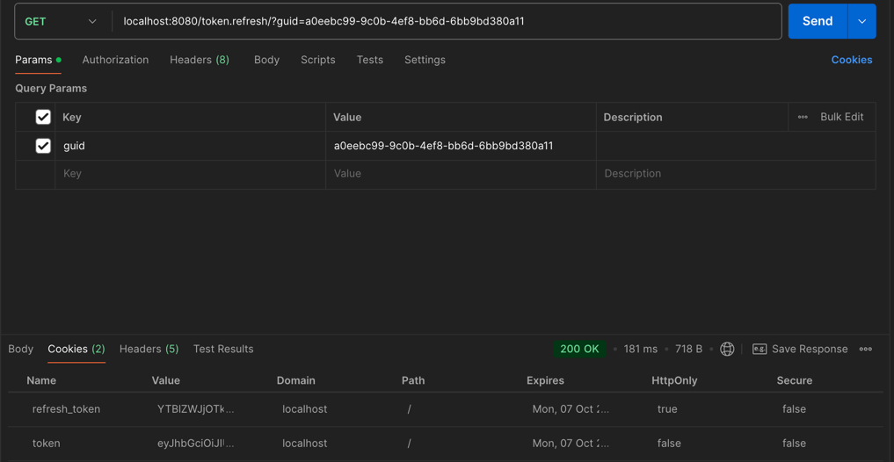

# Тестовое задание "Онлайн библиотека песен"

## Содержание
- [Задание](#задание)
- [Реализация](#реализация)
    - [Структура проекта](#структура-проекта)
    - [Пример запросов](#примеры-запросов)

___
### Задание

Написать часть сервиса аутентификации.

Два REST маршрута:

- Первый маршрут выдает пару Access, Refresh токенов для пользователя с идентификатором (GUID) указанным в параметре запроса
- Второй маршрут выполняет Refresh операцию на пару Access, Refresh токенов

**Требования:**

Access токен тип JWT, алгоритм SHA512, хранить в базе строго запрещено.

Refresh токен тип произвольный, формат передачи base64, хранится в базе исключительно в виде bcrypt хеша, должен быть защищен от изменения на стороне клиента и попыток повторного использования.

Access, Refresh токены обоюдно связаны, Refresh операцию для Access токена можно выполнить только тем Refresh токеном который был выдан вместе с ним.

Payload токенов должен содержать сведения об ip адресе клиента, которому он был выдан. В случае, если ip адрес изменился, при рефреш операции нужно послать email warning на почту юзера (для упрощения можно использовать моковые данные).

___
## Реализация:
Для взаимодействия с ```JWT``` использовал библиотеку ```golang-jwt/v5```, написал слой взаимодействия с токеном и расположил в [jwt](./pkg/jwt).
Использовал следующие поля в токене: ```iss```, ```sub```, ```exp```, ```iat``` в качестве стандартных полей и добавил дополнительное поле ```ip```. <br>

Рефреш токен реализовал следующим образом ```GUID IP```, так как длина ```GUID``` составляет 32 символа, а в совокупности с ```IP``` адрессом достигает 54 символов (```IPv4```).
Сохраняем его в куки пользователя используя ```base64```, а в БД сохраняем только его хеш с использованием библиотеки ```bcrypt```. <br>
Для проверки изменения ```IP``` получаем ```refresh token``` с куки, валидируем и проверяем эквивалентны ли ```ip``` с токена и с заголовка запроса.

Запросы с успехами и ошибками логируются с использованием библиотеки ```slog```, хендлеры используют пути ```/token.get/?guid``` и ```/token.refresh/?guid```, оба запроса являются методом **GET**.

В качестве модели для хранения в базе данных выбрал простейшую модель с одним полем: ```guid``` + ```token```.

В проекте используется ```Docker``` и ```Docker-compose```, используются ```unit``` (для jwt сервиса) и ```functional``` (с использованием настоящей бд) тесты.
___
### Структура проекта
```
cmd
└── backend
    └── main.go <- Точка входа в приложение
internal
├── api
│   ├── auth
│   │   └── test
│   │       └── ... <- Функциональные тесты
│   │   ├── const.go 
│   │   ├── get.go <- Функция получения токенов
│   │   ├── refresh.go <- Функции обновления токенов
│   │   └── handler <- Handler запросов
│   └── email
│       └── ... <- Мок отправки сообщения
├── app
│   └── app.go <- Код инициализации
├── config
│   └── config.go <- Конфигурационный файл
├── migrations
│   └── ... <- Файлы миграций
├── models
│   └── user.go <- Модель пользователя
├── token
│   └── token.go <- Слой для дополнительной изоляции
└── usecase
    ├── repo
    │   └── postgres
    │       └── ... <- Файлы для работы с postgres
    └── user.go <- Слой для взаимодействия с БД   
pkg
└── jwt
     ├── config.go <- Файл конфигурации сервиса
     ├── error.go <- Файл с ошибками
     ├── jwt_test.go <- Unit тесты сервиса
     └── service <- Сервис взаимодействия с токеном
Dockerfile
docker-compose
.env <- Переменные окружения для docker и конфигурации
```
___

### Примеры запросов
**Получение токенов**


**Обновление токенов**

